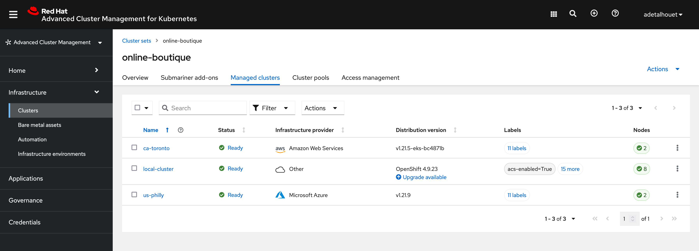
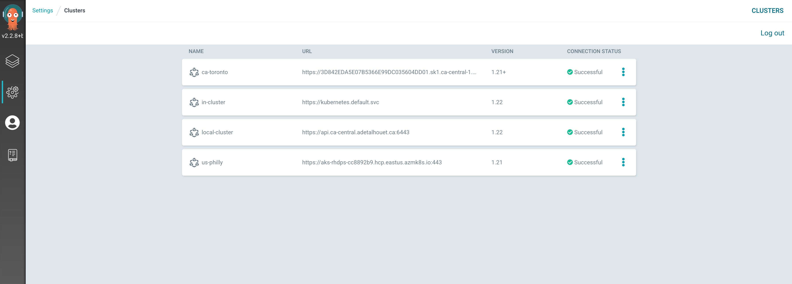
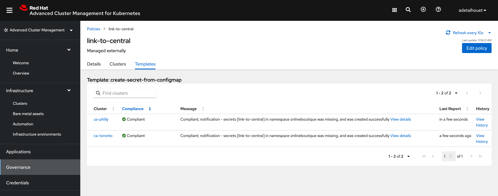
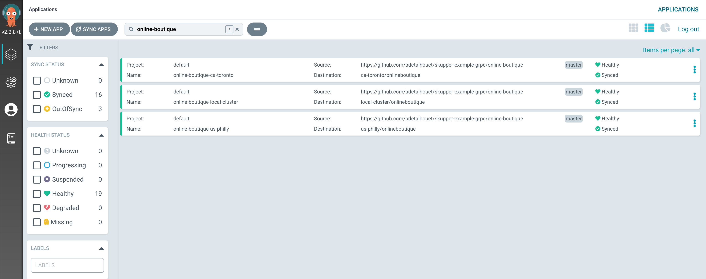

# Multi-cluster Cloud-Native (microservices) application demo

This tutorial demonstrates how to deploy the [Online Boutique](https://github.com/GoogleCloudPlatform/microservices-demo/) microservices demo application across bare metal and multiple Kubernetes clusters that are located in different public and private cloud providers. This project contains a 10-tier microservices application developed by Google to demonstrate the use of technologies like Kubernetes.

In this tutorial, you will create a Virtual Application Network, using Skupper, that enables communications across a bare metal server, the public and private clusters. You will then deploy a subset of the application's grpc based microservices to each environment, using an ArgoCD ApplicationSet. 
You will then be able to access the `Online Boutique` web interface to browse items, add them to the cart and purchase them.

## Table of Contents

<!-- TOC -->
- [High level architecture](#high-level-architecture)
- [Expected result](#expected-result)
- [Prerequisites](#prerequisites)
- [Current setup](#current-setup)
- [Create a managed cluster set](#create-managed-cluster-set)
- [Import the managed clusters into ArgoCD](#import-the-managed-clusters-into-argocd)
- [Deploy the Virtual Application Network](#deploy-the-virtual-application-network)
    - [Site establishment](#site-establishement)
    - [mTLS establishement](#mtls-establishement)
    - [Skupper gateway for bare metal server](#skupper-gateway-for-bare-metal-server)
    - [Service Layer Interconnect](#service-layer-interconnect)
- [Deploy the application](#deploy-the-application)
    - [Access the online boutique](#access-the-online-boutique)
<!-- TOC -->

## High level architecture


## Expected result


## Prerequisites

- Red Hat OpenShift 4.9
- Red Hat Advanced Cluster Management 2.4
- OpenShift GitOps on the cluster where RHACM is installed
- At two clusters that are imported into RHACM (could be 2 or more)
- One bare metal server (could be a VM)
    - [skupper cli installed](https://skupper.io/start/index.html#step-1-install-the-skupper-command-line-tool-in-your-environment)

## Current setup

I have the following clusters already imported in RHACM. 
~~~
$ oc get managedcluster
NAME            HUB ACCEPTED   MANAGED CLUSTER URLS                                                          JOINED   AVAILABLE   AGE
ca-toronto      true           https://3D842EDA5E07B5366E99DC035604DD01.sk1.ca-central-1.eks.amazonaws.com   True     True        47h
local-cluster   true           https://api.ca-central.adetalhouet.ca:6443                                    True     True        62d
us-philly       true           https://aks-rhdps-cc8892b9.hcp.eastus.azmk8s.io:443                           True     True        2d1h
~~~

When RHACM manages a cluster, it creates a namespace that have its name, and uses this namespace to host information it controls, such as policies generated for that cluster.

## Create a managed cluster set

In order to manage the various K8S clusters, we create a `ManagedClusterSet` called **online-boutique** in Red Hat Advanced Cluster Management. To add clusters in this clusterSet, we need to add the following label `cluster.open-cluster-management.io/clusterset=online-boutique` to the `ManagedClusters` to import.

This clusterSet is then bound to a specific namespace, using a `ManagedClusterSetBinding`. This allows ACM to take action in these clusters through that namespace. In our case, we will bound the clusterSet to `openshift-gitops` namespace, as this is where we will deploy ArgoCD ApplicationSet.

Apply the following

~~~
oc apply -f managed-cluster-set.yaml
oc label managedcluster ca-toronto cluster.open-cluster-management.io/clusterset=online-boutique
oc label managedcluster us-philly cluster.open-cluster-management.io/clusterset=online-boutique
oc label managedcluster local-cluster cluster.open-cluster-management.io/clusterset=online-boutique
~~~

This is the result in RHACM



[Find more information about ManagedClusterSet](https://access.redhat.com/documentation/en-us/red_hat_advanced_cluster_management_for_kubernetes/2.4/html/clusters/managing-your-clusters#creating-a-managedclusterset)

## Import the managed clusters into ArgoCD

Now that we created the grouping of clusters to work with, let's import them in ArgoCD. Do to so, we need to create a `GitOpsCluster` that will define where is the ArgoCD to integrate with, along with the `Placement` rule to use. In our case, we will use the label `local-argo: True` label to dennotate clusters that should be imported.

Apply the following

~~~
oc apply -f gitopscluster.yaml
oc label managedcluster ca-toronto local-argo=True
oc label managedcluster us-philly local-argo=True
oc label managedcluster local-cluster local-argo=True
~~~

This is the result in ArgoCD



[Find more information about the integration of ACM with ArgoCD](https://access.redhat.com/documentation/en-us/red_hat_advanced_cluster_management_for_kubernetes/2.4/html/applications/managing-applications#gitops-config)

## Deploy the Virtual Application Network

Skupper is the technology being used to interconnect the K8S clusters together, along with our database that resides in a bare metal server. 

[Find more information about Skupper here](https://skupper.io/).

### Site establishment

In order to deploy Skupper across all the 3 clusters, we will use an ArgoCD ApplicationSet. It will use the [clusterDecisionResource](https://argocd-applicationset.readthedocs.io/en/stable/Generators-Cluster-Decision-Resource/) generator and will use a `Placement` rule using the label `online-boutique: True` to match clusters for which to generate an Application.

To customize the manifest deployed in each site, we are using Kustomize with one overlay folder per cluster, matching the cluster name.

As we have one cluster supporting [Operator Lifecycle Manager](https://olm.operatorframework.io/), and two clusters not supporting it, we have two methods of deploying Skupper site controller: one using the [Skupper operator](skupper/base/operaror), one using the [manifests](skupper/base/site-controller).
The way to deploy [Skupper router](skupper/base/instance) is common to all site, and will be customized with the site name and site specific authentication method.

Apply the following

~~~
oc create -f online-boutique-placement.yaml
oc label managedcluster ca-toronto online-boutique=True
oc label managedcluster us-philly online-boutique=True
oc label managedcluster local-cluster online-boutique=True
oc apply -f skupper/appset-skupper.yaml
~~~

This is the result in ArgoCD. It is expected the `skupper-local-cluster` ArgoCD Application shows out-of-sync, we will explain that in the next section.
In each site, in the namespace `onlineboutique` you should see the Skupper pod. At this point, there is no connectivity between the sites.


### mTLS establishement

Skupper rely on an mTLS to establish a Virtual Application Network. As such, it requires a `Secret` containing the certificate authority, the certificate and the key to be present in all sites.
To have Skupper populating the TLS data into a secret, we can simply create an empty secret with this label `skupper.io/type: connection-token-request`. Skupper site controller will populate all the required information in this secret automatically. In our example, the secret will be generated in the **local-cluster**.
Given we are deploying the secret using GitOps, as soon as Skupper adds data into it, ArgoCD will report the secret out-of-sync. This is expected, and we purposely disabled `self-heal` in this ArgoCD Application because we do tolerate this out-of-sync. We will see later why it is very useful.

Once the TLS data exists, it needs to be provided to the other sites in order to setup the mTLS session. To do so, we will use an  along with templating functions to copy the secret data over the remote sites. The policy will match clusters based on the `PlacementRule` defined; in our case, it is matching cluster with label `link-to-central: True`.

As defined in the policy, using the templating functions, the secret looks like this:
~~~
kind: Secret
apiVersion: v1
metadata:
    name: link-to-central
    namespace: onlineboutique
    labels:
    skupper.io/type: connection-token
    annotations:
    edge-host: '{{hub ( index ( lookup "v1"  "Secret" "onlineboutique" "link-to-central").metadata.annotations "edge-host" ) hub}}'
    edge-port: '443'
    inter-router-host: '{{hub ( index ( lookup "v1"  "Secret" "onlineboutique" "link-to-central").metadata.annotations "inter-router-host" ) hub}}'
    inter-router-port: '443'
data:
    ca.crt: '{{hub ( index ( lookup "v1"  "Secret" "onlineboutique" "link-to-central").data "ca.crt" ) hub}}'
    tls.key: '{{hub ( index ( lookup "v1"  "Secret" "onlineboutique" "link-to-central").data "tls.key" ) hub}}'
    tls.crt: '{{hub ( index ( lookup "v1"  "Secret" "onlineboutique" "link-to-central").data "tls.crt" ) hub}}'
type: Opaque
~~~

RHACM will render this policy and will place it in each cluster's namespace, based on the matched clusters. This generated policies are also the source of our `skupper-local-cluster` ArgoCD Application out-of-sync status. Again, this is expected, and we will see later why it is very useful.

Given we already deployed the Skupper ApplicationSet previously, let just add the label to have the secret containing the TLS information propageted to our two remote sites.
~~~
oc label managedcluster ca-toronto link-to-central=True
oc label managedcluster us-philly link-to-central=True
~~~

This is the result you should observe in RHACM



[Find more information about ACM Policy template](https://access.redhat.com/documentation/en-us/red_hat_advanced_cluster_management_for_kubernetes/2.4/html/governance/governance#hub-templates)

### Skupper gateway for bare metal server

The last piece of our architecture is connecting the bare metal server to our Virtual Application Network. As part of the overall application, our goal is to host the redis database on bare metal, and reference it using the `redis-cart` name.
In order to provide the redis service in our link fabric, we will create a Skupper gateway that will connect to our `ca-central` site, and we will expose the service using it's IP/PORT.

Run the following in your sever to deploy Redis and expose the redis service.

~~~
podman run -d \
  --name redis_server \
  -v $PWD/redis-data:/var/redis/data  \
  -p 6379:6379 \
  redis
skupper gateway expose redis-cart 10.0.0.249 6379 --protocol tcp -c ca-central -n onlineboutique --type podman --name gateway
~~~

To verify the service is properly exposed, you can use the following command

~~~
$ skupper gateway status -n onlineboutique -c ca-central
Gateway Definitions:
╰─ gateway type: podman version: 1.17.1 url: amqp://127.0.0.1:5672
   ╰─ Bindings:
      ╰─ redis-cart:6379 tcp redis-cart:6379 10.0.0.249 6379
~~~

### Service Layer Interconnect

Now, let's look into the Skupper UI, from the `ca-central` to validate the link is created between the three sites, that our gateway has been properly registered, and that the `redis-cart` service is available.

Retrieve the Route to access Skupper from our `ca-central` cluster
~~~
$ oc get route -n onlineboutique skupper
NAME      HOST/PORT                                               PATH   SERVICES   PORT      TERMINATION          WILDCARD
skupper   skupper-onlineboutique.apps.ca-central.adetalhouet.ca          skupper    metrics   reencrypt/Redirect   None
~~~


## Deploy the application

The application is provided through a Helm chart, where all the various microservice are defined. In order to specify which microservice will be deployed where, we have created site specific Values.yaml file, prefixed with the name of the site.

Similarly as the Skupper site controller deployment, we are using an ApplicationSet that will use the samepPlacement rule defined prior; e.g. using label `online-boutique: True`.

Finally, we have added a load generator in the `ca-central` site in order to simulate traffic in our website.

Apply the following to deploy the ApplicationSet

```
oc apply -f online-boutique/appset-online-boutique.yaml
```

The ArgoCD Application should be deployed and shown in ArgoCD


We can see in Skupper all the services exposed
![] (assets/skupper-inventory.png)

If all was done correctly, you should see the service interacting with each others


### Access the online boutique

Retrieve the route and access the online boutique

~~~
$ oc get route -n onlineboutique frontend
NAME       HOST/PORT                                                PATH   SERVICES   PORT   TERMINATION   WILDCARD
frontend   frontend-onlineboutique.apps.ca-central.adetalhouet.ca          frontend   http                 None
~~~

